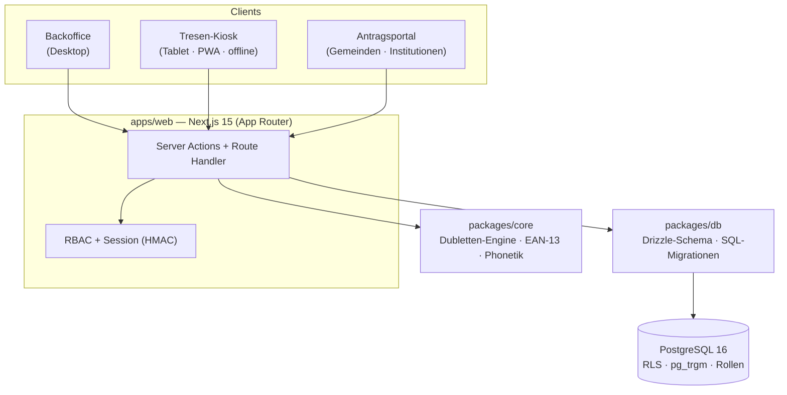

# CareOS

Zentrales Verwaltungssystem für den gemeinnützigen Verein **Tischlein deck dich Vorarlberg**
(Lebensmittelhilfe). Es löst das Kernproblem der bisherigen Insel-Lösungen: **eine zentrale
Datenhaltung mit standortübergreifender Dublettenprüfung**, damit dieselbe Person nicht an mehreren
Ausgabestellen doppelt erfasst wird.

Produktiv im Einsatz – von der Erst­aufnahme über die Kartenausstellung bis zur Ausgabe am Tresen und
zur Antragsverwaltung durch Gemeinden und Sozial­institutionen.

> Dies ist ein reales Produktivsystem, hier als Referenz-/Portfolio-Projekt veröffentlicht.
> Es enthält bewusst **keine** Zugangsdaten, Schlüssel oder personenbezogenen Daten.

**Warum der Code so aussieht:** [`docs/BEGRUENDUNGEN.md`](docs/BEGRUENDUNGEN.md) begründet jede
tragende technische Entscheidung inklusive verworfener Alternativen und offener Schwachstellen.
Die Abarbeitung dieser Schwachstellen steht in [`docs/SPRINTPLAN.md`](docs/SPRINTPLAN.md).

---

## Highlights

- **Drei Oberflächen, ein System:** Backoffice (Desktop), Tresen-Kiosk (Tablet/PWA, offlinefähig) und ein Antragsportal für Gemeinden/Institutionen.
- **Standortübergreifende Dublettenprüfung** mit Kölner Phonetik, Trigramm-Ähnlichkeit (`pg_trgm`) und Umlaut-Faltung (Müller = Mueller) – live bei der Eingabe und als Batch-Report.
- **Mandantenfähig mit strikter Trennung** auf Datenbankebene (PostgreSQL Row-Level-Security).
- **Datenschutz „by design":** rollenbasierte Zugriffskontrolle, On-Premise-OCR (keine Cloud-Dritten), gesetzliche Löschfristen, Audit-Log.
- **Barcode-Karten (EAN-13)** erzeugen und drucken (PVC-Karte & Etikett), inkl. Ablauf-, Sperr- und Ersetzungslogik.
- **Personalisierbares Live-Dashboard** (Kennzahlen in Echtzeit, Favoriten, Widgets) und **installierbar als App (PWA)**.

---

## Architektur

Monorepo (npm-Workspaces) mit klarer Trennung von Domänenlogik, Datenschicht und Applikation:



| Paket | Zweck |
|---|---|
| [`packages/core`](packages/core) | Reine, framework-freie Domänenlogik: deutsche Namens-/Adress-Normalisierung, Kölner Phonetik, EAN-13-Erzeugung (GS1-Präfix 2), Dubletten-Scoring. Unit-getestet (Vitest). |
| [`packages/db`](packages/db) | PostgreSQL-Schema (Drizzle ORM) + versionierte SQL-Migrationen (`001` … `021`) inkl. DB-Rollen, Row-Level-Security-Policies und PII-freien Aggregat-Views. |
| [`apps/web`](apps/web) | Next.js-Applikation: Auth, RBAC, Audit, alle drei Oberflächen, Druck-/Export-/OCR-Funktionen, REST-artige Route Handler und PWA. |
| [`docker/`](docker) | Deployment-Stack: Web (Standalone-Build) + eigenes PostgreSQL + Caddy (automatisches HTTPS). |

---

## Tech-Stack

| Bereich | Technologien |
|---|---|
| **Frontend / App** | Next.js 15 (App Router, Server Components & Server Actions), React 19, TypeScript (strict) |
| **Datenbank** | PostgreSQL 16, Drizzle ORM (postgres-js), `pg_trgm` + `fuzzystrmatch`, Row-Level-Security |
| **Auth & Sicherheit** | argon2id (`@node-rs/argon2`), signierte HMAC-Session-Cookies, serverseitiges RBAC |
| **Domänenfunktionen** | `bwip-js` (EAN-13-Barcodes), `tesseract.js` (On-Premise-OCR), `mammoth` (Word-Formulare), `exceljs` (Export), `pdf-lib` (Bescheide), `nodemailer` |
| **Betrieb** | Docker Compose, Caddy (Let's-Encrypt-Automatik), PWA (Manifest + Service Worker) |
| **Qualität** | Vitest (Domänenlogik), strikter TypeScript-Typecheck über alle Workspaces |

---

## Funktionsumfang

**Personen**
- Erfassung manuell, per OCR (Foto/Scan) und aus Word-Antragsformularen; Excel-Import; Übernahme aus dem Altsystem.
- Dublettenprüfung live und als Batch; Zusammenführen von Datensätzen.
- Archiv/Papierkorb mit gesetzlicher Aufbewahrungsfrist; paginierte Listen.

**Karten**
- EAN-13-Karten erstellen, verlängern, sperren, ersetzen; Druck als PVC-Karte oder Etikett (mit Barcode).
- Automatik: Karten, die länger als 6 Monate inaktiv sind, wandern in einen Papierkorb (nur manuell endgültig zu leeren).

**Ausgabestation** (ein Laptop für alle Ausgabestellen)
- Laptop einmal per Code koppeln (`/ausgabe`, ohne Standortbindung); Ausgabe starten = Standort wählen (vorbelegt aus Öffnungszeiten/Dienstplan), Name antippen, persönliche PIN (Einmal-PIN vom Büro, beim ersten Anmelden ersetzt; 5 Fehlversuche = 15 min Sperre). Buchungen laufen über ein technisches Konto, die Person steht an der Sitzung und im Audit-Log.
- Ausgabe-Sitzung je Person und Standort: „Person wechseln“, „Ausgabe beenden“ mit Kassenzählung (Soll aus den Buchungen, Differenz), Übergabe; vergessene Sitzungen werden beim nächsten Start automatisch geschlossen und markiert. Optional stempelt Start/Ende Kommen/Gehen. Büro-Konten starten Sitzungen unter dem eigenen Login. Verwaltung: Stammdaten → Ausgabestation (Geräte, PIN-Berechtigungen, Sitzungen 30 Tage). Druck ohne Dialog per Chrome `--kiosk-printing` (Anleitung).

**Tresen-Kiosk** (rollen­gesperrt für Zivildiener)
- Scan → Ampel (grün/rot) → Ausgabe bestätigen; Geld-/Schuldenverwaltung, Foto, Gruppen & laufende Nummern.
- Offline-Warteschlange mit Sync (PWA); Suche über Name/Adresse/Telefon (nur aktive Kartenhalter).

**Auswertungen & Ausgaben**
- Tages-Dashboard je Ausgabestelle (Anwesenheiten, Einnahmen, Ausstand), Datumsfilter, Excel-Export.

**Antragsportal** (Gemeinden & Institutionen)
- Anträge erfassen, Anspruchsprüfung, Bescheid-PDF, Übergabe der bewilligten Person an TDD – strikt mandantengetrennt (RLS).
- Rückkanal: Stand bei TDD je Antrag (übergeben → übernommen → Karte → Bezug → läuft ab), Verlängerungsantrag vorbefüllt aus dem Vorgänger, Vollständigkeits-Checkliste (Einwilligung/E-Mail Pflicht für den positiven Bescheid).
- Rückfragen/Verlauf je Antrag zwischen Organisation und TDD-Büro (`/rueckfragen`); Statistik je Organisation (druckbar); eigene Startseiten für Gemeinde (Antragsliste, Aufgaben) und Institution (Klient:innen nach Betreuungsstand, Wohnort).

**A2 · Arbeitszeit nach AZG** (Zentralsystem)
- Soll je Tag aus fixer Wochenverteilung (§ 19c), gesetzliche Feiertage (berechnet) und betriebsfreie Tage, Urlaub/Krankenstand als Gutschrift; Monatsauswertung (`/zeit/monat`) mit Zeitkonto (Anfangssaldo, feste Abschlüsse), Mehrarbeit Teilzeit (§ 19d) und Überstunden je Woche; AZG-Prüfung (`/zeit/pruefung`): Tages-/Wochenhöchstarbeitszeit, Ruhepause, Ruhezeit 11 h, Sonntag/Feiertag, vergessenes Ausstempeln; Regeln/Zuschläge KV-abhängig einstellbar (`/zeit/regeln`); Korrekturen nur mit Begründung, Monatsabschluss sperrt Buchungen (§ 26 AZG). Reine Logik in `lib/azg.ts`, `lib/feiertage.ts` mit Tests.

**A3 · Abwesenheiten nach UrlG/EFZG** (Zentralsystem)
- Arten Urlaub, Krankenstand, Zeitausgleich, Pflegefreistellung, Sonderurlaub, unbezahlt; Antrag → Genehmigung; Monatskalender „wer fehlt wann“; Krankenbestätigung ab Tag 3. Urlaubskonto je Person: Anspruch aus Wochen × Arbeitstagen der Verteilung (aliquot im ersten halben Jahr, 6 Wochen ab 25 Dienstjahren), Übertrag mit FIFO-Verbrauch und 2-Jahres-Verjährung, Resturlaub-Startwert aus alter Führung; Krankenstand mit EFZG-Stufen (6/8/10/12 Wochen); Pflegefreistellung eine Arbeitswoche. Reine Logik in `lib/abwesenheit.ts` mit Tests; Abwesenheiten fließen als Gutschrift in die Arbeitszeit und als Konflikt in die Disposition.

**Personalnummern**: automatisch vergeben – Festangestellte 1–99, Zivildiener 100–199, Ehrenamtliche und Fahrer:innen 200–9999 (Migration 051, DB-Funktion `naechste_personalnr`); im Datensatz änderbar innerhalb des Bereichs, im Lohnexport als Personal-Nr.

**A2 · Personalakte nach AVRAG** (Zentralsystem, nur Admin)
- Dienstverhältnis je Person: Beschäftigungsart, Tätigkeit, Einstufung, Grundgehalt, Probezeit (max. 1 Monat, § 19 Abs 2 AngG), Befristung, Kündigungsfrist, Aushändigung des Dienstzettels; ÖGK-Daten (Geburtsdatum, SV-Nummer mit Prüfziffer, Staatsbürgerschaft), Notfallkontakt, Beendigungsart. Vollständigkeits- und Fristenprüfung (`lib/personalakte.ts`, mit Tests) als Hinweise am Datensatz und in der Personalliste.
- Dienstzettel-Druck (`/druck/dienstzettel`) mit allen Mindestangaben des § 2 Abs 2 AVRAG (Fassung 2024), Arbeitgeber-Angaben zentral unter `/zeit/regeln`; Datenschutzinformation für Mitarbeitende nach Art. 13 DSGVO (`/druck/datenschutz-personal`).
- Dokumente je Person (Dienstzettel, Vertrag, Zeugnis, Führerschein, Unterweisung …) mit Ablaufdatum, Ablage unter `STORAGE_DIR/personal`, Download nur für Admin (`/dokument/personal/<id>`); Datenbankrolle `tdd_ops` hat keinen Zugriff. Aufbewahrung 7 Jahre ab Ende des Austrittsjahres (§ 132 BAO), danach löscht der Retention-Job Dokumente und sensible Felder.

**A5 · Dienstplan** (Personal)
- Wochenraster Person × Tag (`/dienstplan`): Dienste mit von/bis, Pause, Standort, Tätigkeit (Ausgabe, Fahrdienst, Lager, Büro); Standard-Dienst je Wochentag am Personal-Datensatz (Vorschlag aus der Wochenverteilung), „Aus Standard füllen“ und „Vorwoche übernehmen“ lassen Tage mit genehmigter Abwesenheit aus. Abwesenheiten, offene Anträge und Touren der Disposition werden je Tag eingeblendet.
- Prüfung (`lib/dienstplan.ts`, mit Tests): Tages-/Wochenhöchstarbeitszeit, Pause ab 6 h, Ruhezeit 11 h (auch über den Wochenwechsel), Überschneidungen, Dienst trotz Abwesenheit, Feiertag/Sonntag (ARG), Abstand zum Wochensoll, Besetzung der Öffnungszeiten je Ausgabestelle. Veröffentlichen nur ohne Fehler; erst dann sehen Mitarbeitende ihre Dienste in „Mein Bereich“. Aushang-Druck (`/druck/dienstplan`, A4 quer) mit Besetzung je Standort.

**P6 · Zivildienst & Lohnexport**
- Zivildienst nach ZDG und ZISA-Vorgaben (`/personal/zivildienst`, Stammdaten am Personal): Dienstzeit 9 Monate ab Zuweisung, Dienstfreistellung je vollem Monat (Werktage, einstellbar), Fehltage (Kalendertage, inkl. früherer Einsatzstelle) mit Verlängerung ab 24 Tagen und voraussichtlichem Ende. Eigene **Zivi-Regeln** unter `/zeit/regeln` (Wochendienstzeit min/max, Tagesmaximum, Pause, Ruhezeit, Sonn-/Feiertagsdienst) – Zeiterfassung und Dienstplan prüfen Zivis dagegen (ZDG statt AZG, keine Mehrarbeit/Überstunden, Mehrdienst als Zeitausgleich), Stammdaten-Prüfung der Wochendienstzeit laut Bescheid. **Meldeliste** an die Zivildienstserviceagentur (Dienstantritt, Krankheit über 3 Tage, Verlängerung, Dienstende) mit „gemeldet“-Vermerk; Druck „Bestätigung über den Zivildienst“ (`/druck/zivildienst`). Zivis erscheinen nicht im UrlG-Urlaubskonto; „Mein Bereich“ zeigt Dienstfreistellung/Fehltage. Reine Logik `lib/zivildienst.ts` mit Tests.
- **Zeitkonto-Widget** (Dashboard, automatisch für Logins mit Personal-Datensatz; auch in „Mein Bereich“): Wochenstunden als Kreisdiagramm (gearbeitet / Gutschrift / noch zu arbeiten, Tagesbalken), Zeitkonto = verfügbarer Zeitausgleich, laufender Monat, Urlaubskonto (Anspruch, Übertrag, bezogen, geplant, Resturlaub, Verfall) bzw. Dienstfreistellung für Zivis.
- Lohnexport (`/zeit/lohn`, nur Admin): Monatszeile je Arbeitnehmer:in (Soll/Ist/Gutschrift/Saldo/Zeitkonto/Mehrarbeit/Überstunden, Urlaubs-, Zeitausgleichs-, Kranken- (Kalender- und Arbeitstage), Pflege-, Sonderurlaubs-, unbezahlte Tage, Feiertage, Abschluss-Stand, Hinweise) als Excel oder CSV (de-AT); feste Monatsabschlüsse haben Vorrang, jeder Download wird protokolliert. Kein Gehalt im Export. Logik `lib/lohn.ts` mit Tests.

**P1 · Logins & Mein Bereich**
- Rolle `MITARBEITER` (Selbstservice ohne Klientendaten) und „Mein Bereich“ (`/mein`) für alle Büro-Rollen mit verknüpftem Personal-Datensatz: Zeitkonto, eigene Zeiten des Monats, Urlaubskonto, Krankenstand, Urlaub/Zeitausgleich beantragen (landet als Antrag beim Büro, zurückziehbar), Krankmeldung ab heute/gestern.
- Austritt am Personal-Datensatz sperrt den Login (beim Speichern, beim Login-Versuch und täglich im Retention-Job; Grund „Austritt“ in der Benutzerverwaltung sichtbar). Login-Verlauf je Konto (`/admin/benutzer/<id>/verlauf`): Anmeldungen, Fehlversuche, Sperren, Passwort-/2FA-/Kontoänderungen mit IP aus dem Audit-Log; letzter Login in der Benutzerliste. Standortbindung wie bisher über den Standort am Konto (Kasse, Personenlisten).
- Navigation nach Arbeitsbereichen (Start · Klient:innen · Ausgabe · Personal · Logistik · Verwaltung) mit Untermenüs statt flacher Liste; jede Rolle sieht nur ihre Gruppen.

**A4 · Touren & Disposition** (Zentralsystem)
- Stammdaten: Abholstellen (Betriebe mit Abholtagen, Fenster, Kühlbedarf, Hinweisen), Fahrzeuge (Kühlung, elektrisch, Pickerl, Werkstatt), Fahrer:innen am Personal (Führerschein, Fahrertage, Login-Verknüpfung).
- Wochenplan (Tourvorlagen je Wochentag mit Stopp-Abfolge) → Tagesdisposition (`/touren`): Touren erzeugen, Fahrer/Fahrzeug zuweisen, Konflikte live (abwesend, Werkstatt, Kühlware ohne Kühlung, Doppelbelegung, Pickerl), Abwesenheiten, Laufzettel-Druck.
- Fahrer-Handy (`/fahrt`, Rolle FAHRER): Tour des Tages, Stopps abhaken, Kisten/kg erfassen (gerettete Lebensmittel), Navigation, km-Stand.
- Karte & Routenoptimierung: Abholstellen/Standorte werden beim Speichern geocodiert (Photon/komoot, DE; Marker von Hand nachziehbar), Touren und Vorlagen zeigen die Strecke, „Reihenfolge optimieren“ berechnet die kürzeste Runde ab Lager Vandans mit fester letzter Lieferung – Routing über eigenen OSRM auf dem Server (`scripts/osrm-setup.sh`, OSM-Auszug Vorarlberg), Kartenkacheln von OpenStreetMap.
- **Geofencing** (Migration 052): Kreis um Abholstellen/Standorte/Lager (Radius je Stelle, Standard 150 m). Das Fahrzeug-Tablet meldet während einer Tour (Status unterwegs) seine Position an `/api/geofence`; gespeichert werden nur Ankunft/Abfahrt-Ereignisse (`tour_ereignisse`), Stillstände > 30 min und die letzte Position (wird am Tourende gelöscht) – kein Bewegungsprofil. Nur mit **Zustimmung** der fahrenden Person (`staff.ortung_zustimmung_am`, Druck `/druck/ortung`, § 10 AVRAG). Büro: Zeitleiste/Aufenthalte in der Tour, Fahrzeugmarker auf der Karte, 📍-Pill in der Disposition, Ø Aufenthalt je Abholstelle; Ereignisse nach einstellbarer Frist (Regeln, 90 Tage) gelöscht. Logik `lib/geofence.ts` mit Tests.
- Posteingang der Abholangebote von der Homepage (`/touren/angebote`, Job `/api/jobs/angebote`; braucht `HOMEPAGE_API_URL` + `UEBERGABE_TOKEN`).

**Wartungsplattform** (`apps/ops`, nur Betreiber)
- Eigene Anmeldung (Passwort + TOTP), Datenbankrolle `tdd_ops` ohne Leserecht auf Personendaten. Systemstatus (Fach-App, DB, Zertifikat, Platte, Backup, Migrationen), Kennzahlen aus PII-freien Views, Benutzer einladen/sperren/2FA-Reset/Passwort-Link (über SECURITY-DEFINER-Funktionen, Migration 032), Konfiguration (Standorte, Löschfristen, Auswahllisten, Organisationen), Protokoll ohne Personenbezug, Backup jetzt / Neustart (Host-Agent `scripts/ops-agent.sh`), Wartungsmodus (Datei-Schalter, Caddy liefert 503-Hinweisseite).
- Mandanten & Support: jede Gemeinde/Institution als Mandant (Konten, Aktivität, Anträge/Rückfragen als Zahlen, Fehler), je Benutzer Zustand (zuletzt gesehen, Version, Browser, Kiosk-Warteschlange), Fehler mit Kennung, Aktionen ohne Datensatz-Bezug. Die Fach-App meldet dafür selbst (`instrumentation.ts`, `components/Lebenszeichen.tsx`, `/api/ereignis` → `app_events`, bereinigt, 30 Tage).

**Verwaltung & Dashboard**
- Stammdaten (Standorte, Preise, Öffnungszeiten, Listen), getrennte Benutzerverwaltung (Rollen, Freigaben).
- Personalisierbares Live-Dashboard: Echtzeit-Kennzahlen, Favoriten (per Rechtsklick), Widgets (Wetter, Standorte). Installierbar als App.

---

## Sicherheit & Datenschutz (DSGVO)

- **Zwei DB-Rollen:** `tdd_app` (Fach-App, RBAC-gefiltert) und `tdd_ops` (Wartung, **kein** PII-Lesezugriff – nur Aggregat-Views).
- **Row-Level-Security** trennt Organisationen (TDD, 96 Vorarlberger Gemeinden, Institutionen) auf Datenbankebene.
- **Mandanten (Unternehmen)** als globale Ebene darüber: jede Tabelle trägt `tenant_id`, Postgres filtert
  über eine Sitzungsvariable (`app.current_tenant_id`) – siehe [Mandantenfähigkeit](#mandantenfähigkeit).
- **RBAC serverseitig** erzwungen (z. B. „Kasse" sieht keine Personenlisten oder Dokumente).
- **Passwörter** ausschließlich als argon2id-Hash; **On-Premise-OCR** ohne Cloud-Dritte; **EU-Hosting**.
- **Löschfristen** (Personendaten 3 Jahre, Rohscans 90 Tage) und **append-only Audit-Log**.

### Mandantenfähigkeit

Seit Migration 053 ist CareOS mandantenfähig: Über den Organisationen (Gemeinden, Institutionen, Träger)
liegt die Ebene **Mandant = Unternehmen** (`tenants`). Der Bestand gehört dem Mandanten
„Tischlein deck dich Vorarlberg“ (`e3b29c11-0000-4000-a000-000000000000`).

- **Datenbank:** `tenant_id` auf allen Fachtabellen (Default aus der Sitzungsvariable
  `app.current_tenant_id`), Fremdschlüssel mit `ON DELETE CASCADE`, Eindeutigkeiten je Mandant
  (Standortkennung, Kartennummer, Personalnummer, Benutzername). Für `tdd_app` gilt eine
  *restriktive* RLS-Policy `tenant_isolation` (UND-verknüpft mit den bestehenden Organisations-Policies):
  ohne Kontext ist nichts sichtbar, fremde Mandanten weder lesbar noch schreibbar.
  `tdd_ops` sieht ohne Kontext alle Mandanten (nur Metadaten), mit Kontext nur den gewählten.
- **Anwendung:** ein Verbindungspool je Mandant (`-c app.current_tenant_id=…` beim Verbindungsaufbau),
  Kontext per `AsyncLocalStorage` (`runWithTenant`/`currentTenantId` in `@tdd/db`). Der Mandant kommt aus der
  signierten Session, bei Geräten (Fahrzeug-Tablet, Ausgabestation) aus dem Cookie-Präfix, sonst aus dem
  Header `x-tenant-id`, den die Middleware aus `TENANT_HOSTS` (`host=uuid;host2=uuid`) ableitet;
  Rückfall `DEFAULT_TENANT_ID`. Hintergrundjobs laufen je aktivem Mandanten.
- **Wartungsplattform:** Mandanten-Auswahl im Kopf (steuert den Pool), Seite „Mandanten (Unternehmen)“ zum
  Anlegen (`ops_create_tenant`: Organisation, Zeitregeln, Löschfristen, Auswahllisten werden mitgeliefert)
  und Schalten. Neue Mandanten bekommen ihr erstes Admin-Konto per Einladung.
- **Migrationen** laufen mit gesetztem Bestandsmandanten; alle Migrationen sind wiederholbar
  (Integrationstests spielen sie jeweils komplett ein). Isolationstest: `apps/web/test/integration/tenants.test.ts`.

---

## Projektstruktur

```
tdd-verwaltung/
├─ packages/
│  ├─ core/            # Dubletten-Engine, Phonetik, EAN-13 (framework-frei, getestet)
│  └─ db/             # Drizzle-Schema + SQL-Migrationen (001…021), Rollen, RLS, Views
├─ apps/
│  └─ web/            # Next.js: (app) Backoffice · kiosk · portal · api · druck · lib
├─ docker/            # docker-compose.yml + Caddyfile (Web + PostgreSQL + HTTPS)
└─ docs/              # Planung, Entscheidungsprotokoll, Mockups
```

---

## Lokal starten

Voraussetzungen: Node ≥ 20, eine PostgreSQL-16-Instanz.

```bash
npm install
npm test                     # Unit-Tests: Dubletten-Engine, EAN, Anspruch, Zeit, Urlaub, Rechtematrix, Formulare
npm run typecheck            # strikter Typecheck über alle Workspaces
npm run lint                 # ESLint mit Typinformation (no-floating-promises als Fehler)
```

Die Integrationstests brauchen eine echte, leere PostgreSQL 16 (Migrationen, RLS-Mandantentrennung,
PII-Barriere der Wartungsrolle, Idempotenz der Ausgabe, Kartennummern-Sequenz):

```bash
docker run -d --name tdd-test-db -p 5432:5432   -e POSTGRES_USER=tdd_owner -e POSTGRES_PASSWORD=test -e POSTGRES_DB=tdd_test postgres:16-alpine
npm run test:integration -w @tdd/web
docker rm -f tdd-test-db
```

Datenbank aufsetzen und App starten:

```bash
# 1. Alle Migrationen der Reihe nach einspielen (als DB-Eigentümer)
for f in packages/db/sql/0*.sql; do psql "$ADMIN_DATABASE_URL" -f "$f"; done

# 2. Passwörter der App-Rollen setzen
psql "$ADMIN_DATABASE_URL" -c "ALTER ROLE tdd_app PASSWORD '…'; ALTER ROLE tdd_ops PASSWORD '…';"

# 3. Umgebungsvariablen und Admin-Konto
cp apps/web/.env.local.example apps/web/.env.local     # DATABASE_URL, SESSION_SECRET setzen
node apps/web/scripts/create-admin.mjs admin@example.at 'Administrator'   # fragt das Passwort ab

npm run dev                  # http://localhost:3000
```

Alle Konfigurationswerte sind in [`.env.example`](.env.example) dokumentiert (nur Platzhalter, keine echten Secrets).

---

## Deployment

Isolierter Container-Stack mit eigenem PostgreSQL und automatischem HTTPS über Caddy
([`docker/docker-compose.server.yml`](docker/docker-compose.server.yml)).

Ausgerollt wird ausschließlich über [`scripts/deploy.sh`](scripts/deploy.sh). Bewusst **keine CI bei
einem Fremdanbieter** – die Prüfung läuft dort, wo ohnehin gebaut wird:

1. Quellstand aus Git packen und auf dem Server in ein Stage-Verzeichnis entpacken (nicht in die Produktion)
2. Integrationstests gegen eine Wegwerf-Postgres ([`scripts/verify-integration.sh`](scripts/verify-integration.sh))
3. Kandidaten-Image bauen – Typecheck, Lint und Unit-Tests laufen **im Dockerfile**; ist etwas rot, entsteht kein Image
4. Erst bei Grün: Code übernehmen, nur neue Migrationen einspielen, Container tauschen
5. Nachweis: Login-Seite antwortet, Job-Autorisierung greift

```bash
scripts/deploy.sh            # Stand HEAD; dauert etwa zwei Minuten
```

Betrieb: gehärteter Server (Firewall, fail2ban, automatische Sicherheitsupdates, SSH nur per Schlüssel),
täglich mit [`age`](https://age-encryption.org) verschlüsselte Backups von Datenbank, Uploads und Konfiguration
auf eine Storage Box – der private Schlüssel liegt nicht auf dem Server. Rückspiel-Test über
[`scripts/restore-test.sh`](scripts/restore-test.sh), Healthcheck unter `/api/health`. Nächtliche Jobs
(Kartenablauf, Papierkorb, DSGVO-Löschfristen) laufen tokengeschützt über [`scripts/jobs-cron.sh`](scripts/jobs-cron.sh).

---

## Status & Ausblick

Der fachliche Kern (Personen, Karten, Tresen, Auswertungen, Portal, Verwaltung) ist gebaut und produktiv.
Geplanter Ausbau zu einem zentralen Vereins-System: Mitarbeiter-/Ehrenamts­verwaltung, Zeiterfassung
(NFC + Tablet), Urlaubsverwaltung nach österreichischem Recht sowie Touren-/Fahrerplanung mit Live-Tracking.

---

## Lizenz & Nutzung

© 2026 **Schär Systems** (Dario Schär). Proprietäre Software für Tischlein deck dich Vorarlberg.
Veröffentlichung als Referenz-/Portfolio-Projekt – keine Lizenz zur Weiterverwendung.

**Entwicklung & Betrieb:** Schär Systems · [info@schaer-systems.at](mailto:info@schaer-systems.at)
