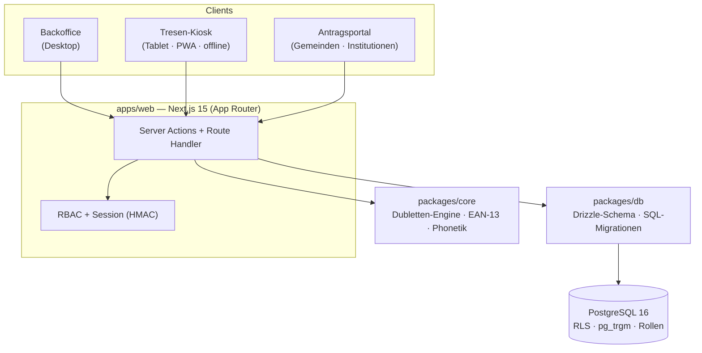

# TDD-Verwaltung

Zentrales Verwaltungssystem für den gemeinnützigen Verein **Tischlein deck dich Vorarlberg**
(Lebensmittelhilfe). Es löst das Kernproblem der bisherigen Insel-Lösungen: **eine zentrale
Datenhaltung mit standortübergreifender Dublettenprüfung**, damit dieselbe Person nicht an mehreren
Ausgabestellen doppelt erfasst wird.

Produktiv im Einsatz – von der Erst­aufnahme über die Kartenausstellung bis zur Ausgabe am Tresen und
zur Antragsverwaltung durch Gemeinden und Sozial­institutionen.

> Dies ist ein reales Produktivsystem, hier als Referenz-/Portfolio-Projekt veröffentlicht.
> Es enthält bewusst **keine** Zugangsdaten, Schlüssel oder personenbezogenen Daten.

---

## Highlights

- **Drei Oberflächen, ein System:** Backoffice (Desktop), Tresen-Kiosk (Tablet/PWA, offlinefähig) und ein Antragsportal für Gemeinden/Institutionen.
- **Standortübergreifende Dublettenprüfung** mit Kölner Phonetik, Trigramm-Ähnlichkeit (`pg_trgm`) und Umlaut-Faltung (Müller = Mueller) – live bei der Eingabe und als Batch-Report.
- **Mandantenfähig mit strikter Trennung** auf Datenbankebene (PostgreSQL Row-Level-Security).
- **Datenschutz „by design":** rollenbasierte Zugriffskontrolle, On-Premise-OCR (keine Cloud-Dritten), gesetzliche Löschfristen, Audit-Log.
- **Barcode-Karten (EAN-13)** erzeugen und drucken (PVC-Karte & Etikett), inkl. Ablauf-, Sperr- und Ersetzungslogik.
- **Personalisierbares Live-Dashboard** (Kennzahlen in Echtzeit, Favoriten, Widgets) und **installierbar als App (PWA)**.

---

## Architektur

Monorepo (npm-Workspaces) mit klarer Trennung von Domänenlogik, Datenschicht und Applikation:



| Paket | Zweck |
|---|---|
| [`packages/core`](packages/core) | Reine, framework-freie Domänenlogik: deutsche Namens-/Adress-Normalisierung, Kölner Phonetik, EAN-13-Erzeugung (GS1-Präfix 2), Dubletten-Scoring. Unit-getestet (Vitest). |
| [`packages/db`](packages/db) | PostgreSQL-Schema (Drizzle ORM) + versionierte SQL-Migrationen (`001` … `021`) inkl. DB-Rollen, Row-Level-Security-Policies und PII-freien Aggregat-Views. |
| [`apps/web`](apps/web) | Next.js-Applikation: Auth, RBAC, Audit, alle drei Oberflächen, Druck-/Export-/OCR-Funktionen, REST-artige Route Handler und PWA. |
| [`docker/`](docker) | Deployment-Stack: Web (Standalone-Build) + eigenes PostgreSQL + Caddy (automatisches HTTPS). |

---

## Tech-Stack

| Bereich | Technologien |
|---|---|
| **Frontend / App** | Next.js 15 (App Router, Server Components & Server Actions), React 19, TypeScript (strict) |
| **Datenbank** | PostgreSQL 16, Drizzle ORM (postgres-js), `pg_trgm` + `fuzzystrmatch`, Row-Level-Security |
| **Auth & Sicherheit** | argon2id (`@node-rs/argon2`), signierte HMAC-Session-Cookies, serverseitiges RBAC |
| **Domänenfunktionen** | `bwip-js` (EAN-13-Barcodes), `tesseract.js` (On-Premise-OCR), `mammoth` (Word-Formulare), `exceljs` (Export), `pdf-lib` (Bescheide), `nodemailer` |
| **Betrieb** | Docker Compose, Caddy (Let's-Encrypt-Automatik), PWA (Manifest + Service Worker) |
| **Qualität** | Vitest (Domänenlogik), strikter TypeScript-Typecheck über alle Workspaces |

---

## Funktionsumfang

**Personen**
- Erfassung manuell, per OCR (Foto/Scan) und aus Word-Antragsformularen; Excel-Import; Übernahme aus dem Altsystem.
- Dublettenprüfung live und als Batch; Zusammenführen von Datensätzen.
- Archiv/Papierkorb mit gesetzlicher Aufbewahrungsfrist; paginierte Listen.

**Karten**
- EAN-13-Karten erstellen, verlängern, sperren, ersetzen; Druck als PVC-Karte oder Etikett (mit Barcode).
- Automatik: Karten, die länger als 6 Monate inaktiv sind, wandern in einen Papierkorb (nur manuell endgültig zu leeren).

**Tresen-Kiosk** (rollen­gesperrt für Zivildiener)
- Scan → Ampel (grün/rot) → Ausgabe bestätigen; Geld-/Schuldenverwaltung, Foto, Gruppen & laufende Nummern.
- Offline-Warteschlange mit Sync (PWA); Suche über Name/Adresse/Telefon (nur aktive Kartenhalter).

**Auswertungen & Ausgaben**
- Tages-Dashboard je Ausgabestelle (Anwesenheiten, Einnahmen, Ausstand), Datumsfilter, Excel-Export.

**Antragsportal** (Gemeinden & Institutionen)
- Anträge erfassen, Anspruchsprüfung, Bescheid-PDF, Übergabe der bewilligten Person an TDD – strikt mandantengetrennt (RLS).

**Verwaltung & Dashboard**
- Stammdaten (Standorte, Preise, Öffnungszeiten, Listen), getrennte Benutzerverwaltung (Rollen, Freigaben).
- Personalisierbares Live-Dashboard: Echtzeit-Kennzahlen, Favoriten (per Rechtsklick), Widgets (Wetter, Standorte). Installierbar als App.

---

## Sicherheit & Datenschutz (DSGVO)

- **Zwei DB-Rollen:** `tdd_app` (Fach-App, RBAC-gefiltert) und `tdd_ops` (Wartung, **kein** PII-Lesezugriff – nur Aggregat-Views).
- **Row-Level-Security** trennt Mandanten (TDD, 96 Vorarlberger Gemeinden, Institutionen) auf Datenbankebene.
- **RBAC serverseitig** erzwungen (z. B. „Kasse" sieht keine Personenlisten oder Dokumente).
- **Passwörter** ausschließlich als argon2id-Hash; **On-Premise-OCR** ohne Cloud-Dritte; **EU-Hosting**.
- **Löschfristen** (Personendaten 3 Jahre, Rohscans 90 Tage) und **append-only Audit-Log**.

---

## Projektstruktur

```
tdd-verwaltung/
├─ packages/
│  ├─ core/            # Dubletten-Engine, Phonetik, EAN-13 (framework-frei, getestet)
│  └─ db/             # Drizzle-Schema + SQL-Migrationen (001…021), Rollen, RLS, Views
├─ apps/
│  └─ web/            # Next.js: (app) Backoffice · kiosk · portal · api · druck · lib
├─ docker/            # docker-compose.yml + Caddyfile (Web + PostgreSQL + HTTPS)
└─ docs/              # Planung, Entscheidungsprotokoll, Mockups
```

---

## Lokal starten

Voraussetzungen: Node ≥ 20, eine PostgreSQL-16-Instanz.

```bash
npm install
npm test                     # Domänenlogik (Dubletten-Engine)
npm run typecheck            # strikter Typecheck über alle Workspaces
```

Datenbank aufsetzen und App starten:

```bash
# 1. Alle Migrationen der Reihe nach einspielen (als DB-Eigentümer)
for f in packages/db/sql/0*.sql; do psql "$ADMIN_DATABASE_URL" -f "$f"; done

# 2. Passwörter der App-Rollen setzen
psql "$ADMIN_DATABASE_URL" -c "ALTER ROLE tdd_app PASSWORD '…'; ALTER ROLE tdd_ops PASSWORD '…';"

# 3. Umgebungsvariablen und Admin-Konto
cp apps/web/.env.local.example apps/web/.env.local     # DATABASE_URL, SESSION_SECRET setzen
node apps/web/scripts/create-admin.mjs admin@example.at 'StartPasswort' 'Administrator'

npm run dev                  # http://localhost:3000
```

Alle Konfigurationswerte sind in [`.env.example`](.env.example) dokumentiert (nur Platzhalter, keine echten Secrets).

---

## Deployment

Isolierter Container-Stack mit eigenem PostgreSQL und automatischem HTTPS über Caddy:

```bash
cp .env.example .env         # Secrets & Domains ausfüllen (openssl rand -hex 32 für SESSION_SECRET)
cd docker
docker compose --env-file ../.env up -d --build
# danach einmalig: Migrationen einspielen, Rollen-Passwörter setzen, Admin anlegen
```

Produktiv läuft das System auf einem gehärteten Server (Firewall, fail2ban, automatische
Sicherheitsupdates, SSH nur per Schlüssel) mit täglichen, verschlüsselten Offsite-Backups.

---

## Status & Ausblick

Der fachliche Kern (Personen, Karten, Tresen, Auswertungen, Portal, Verwaltung) ist gebaut und produktiv.
Geplanter Ausbau zu einem zentralen Vereins-System: Mitarbeiter-/Ehrenamts­verwaltung, Zeiterfassung
(NFC + Tablet), Urlaubsverwaltung nach österreichischem Recht sowie Touren-/Fahrerplanung mit Live-Tracking.

---

## Lizenz & Nutzung

© 2026 **Schär Systems** (Dario Schär). Proprietäre Software für Tischlein deck dich Vorarlberg.
Veröffentlichung als Referenz-/Portfolio-Projekt – keine Lizenz zur Weiterverwendung.

**Entwicklung & Betrieb:** Schär Systems · [info@schaer-systems.at](mailto:info@schaer-systems.at)
